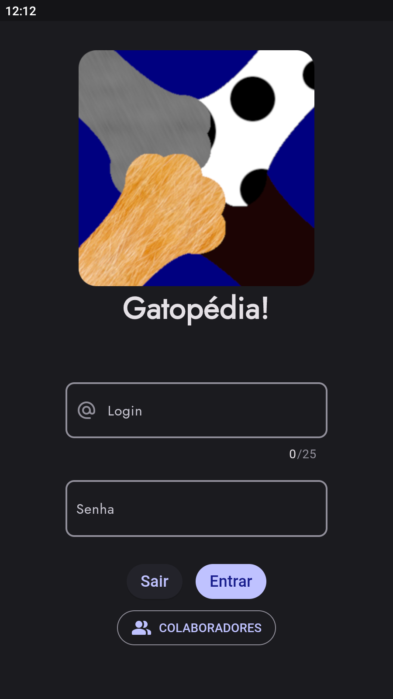
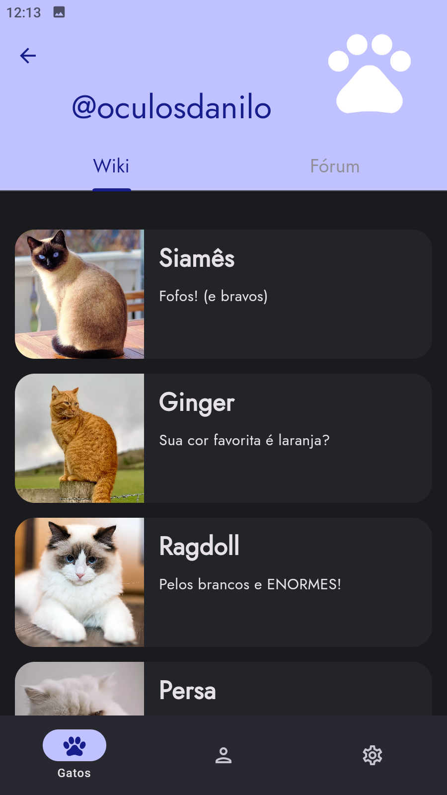
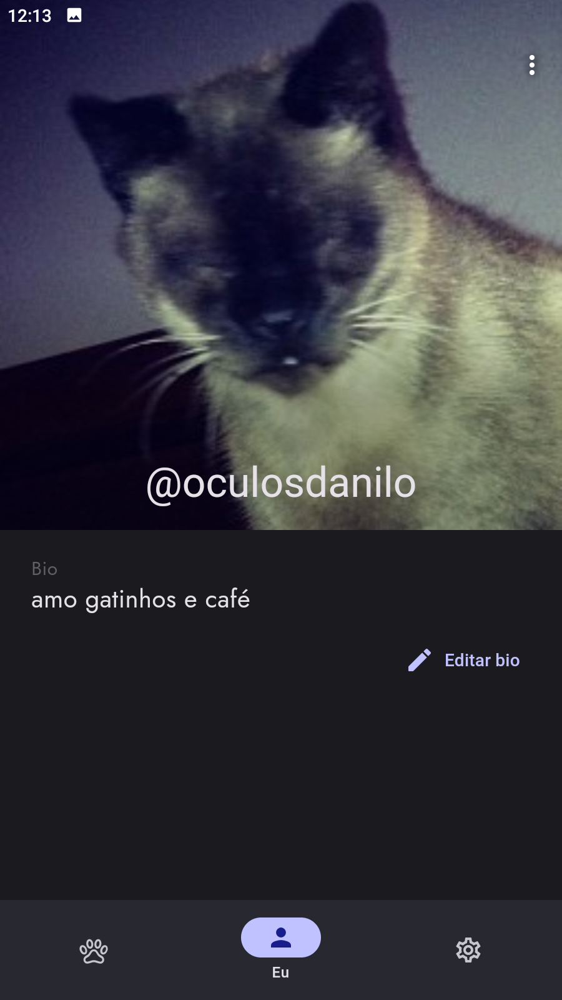

# Gatopédia!

Projeto do antigo Gatopédia (feito em AppInventor) repaginado em Material Design 3 e Flutter.  

### Capturas de tela:

Feito com :heart: por <a href="https://github.com/oculosdanilo">Danilo Lima</a>
